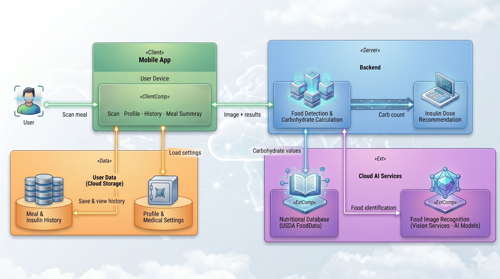
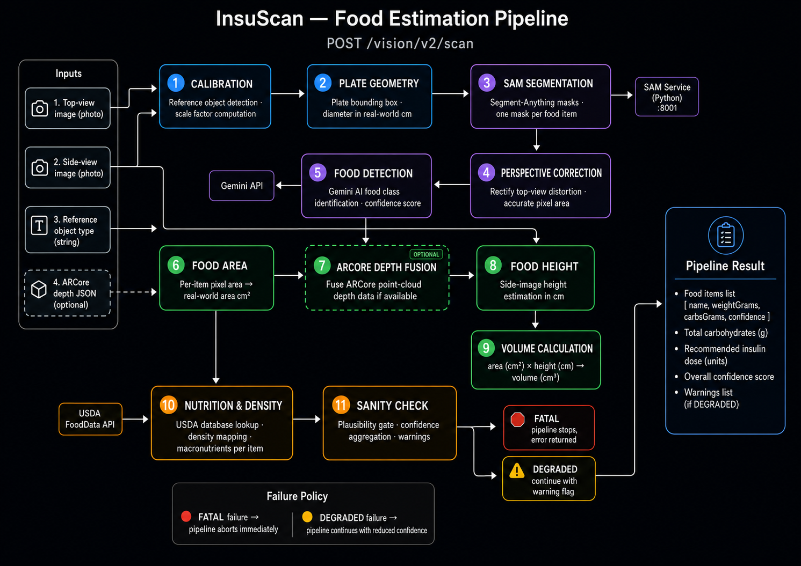
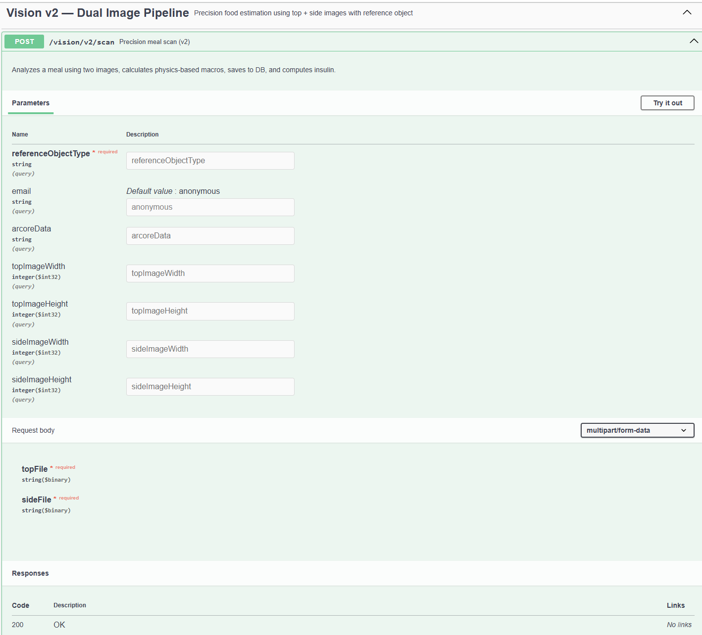

<div align="center">


# InsuScan - Backend Server

**Intelligent food-scanning and insulin-dose management**  
Built with Spring Boot · Firebase Firestore · Computer Vision · AI

[](https://openjdk.org/projects/jdk/21/)
[](https://spring.io/projects/spring-boot)
[](https://firebase.google.com/)
[](https://www.docker.com/)
[](http://localhost:9693/swagger-ui.html)
[](https://www.afeka.ac.il/)

</div>

---

## 🔗 Ecosystem

This server is one half of the **InsuScan** platform:

| Repository | Description | README |
|---|---|---|
| **InsuScan Server** *(you are here)* | Spring Boot REST API + AI food-estimation pipeline | - |
| [**InsuScan Android App**](https://github.com/DanielSelas/InsuScan---AndoridApp) | Kotlin Android client with CameraX, ARCore & AR depth scanning | [View README](https://github.com/DanielSelas/InsuScan---AndoridApp#readme) |

> 📄 **[Documentation site](https://nimib2.github.io/insuscan-server/)**

---

## 📋 Table of Contents

- [Overview](#overview)
- [System Architecture](#system-architecture)
- [Technology Stack](#technology-stack)
- [Food Estimation Pipeline](#food-estimation-pipeline)
- [API Reference](#api-reference)
- [Data Models](#data-models)
- [Getting Started](#getting-started)
- [Configuration](#configuration)
- [Docker Deployment](#docker-deployment)
- [Project Structure](#project-structure)
- [Troubleshooting](#troubleshooting)

---

## Overview

InsuScan Server is the backend powering a diabetes self-management Android application. It exposes a REST API that:

- **Receives food photos** from the mobile client (top-view + side-view), processes them through an 11-stage AI + computer-vision pipeline, and returns per-food-item weight, carbohydrates, and a recommended insulin dose.
- **Manages meal records** - creating, confirming, and completing meal sessions in Firestore.
- **Manages user profiles** - storing personalised insulin settings (carb-ratio, correction factor, target glucose).
- **Calculates insulin doses** - personalised dosing with optional real-time blood-glucose correction.
- **Provides AI-assisted food search** - semantic matching backed by the USDA food database.

---

## System Architecture

<div align="center">
  
</div>

<br>

The server follows a **layered architecture**:

```
Android App  ──► (HTTPS / Retrofit2)  ──►  InsuScan Server (Spring Boot :9693)
                                                    │
                          ┌─────────────────────────┼──────────────────────────┐
                          │                         │                          │
                   REST API Layer           11-Stage Pipeline          Business Logic
                  ┌───────────────┐       ┌──────────────────┐       ┌─────────────────┐
                  │ UserController│       │ Calibration       │       │ MealService      │
                  │ MealController│  ───► │ SAM Segmentation  │       │ UserService      │
                  │ ScanPipeline  │       │ Food Detection    │       │ InsulinService   │
                  │ FoodController│       │ Volume Calc       │       │ NutritionService │
                  │ InsulinCtrl   │       │ Sanity Check      │       └─────────────────┘
                  └───────────────┘       └──────────────────┘
                          │                         │
            ┌─────────────┼─────────────────────────┼────────────────┐
            ▼             ▼                          ▼                ▼
     Firebase        Google                      USDA            SAM Service
     Firestore       Gemini API               FoodData API       (Python :8001)
    (persistence)  (food classif.)           (nutrition DB)    (segmentation)
```

---

## Technology Stack

| Layer | Technology | Version |
|---|---|---|
| Runtime | Java (OpenJDK) | 21 |
| Framework | Spring Boot | 3.5.0 |
| Build | Gradle | 8.x |
| Database | Firebase Firestore | Admin SDK 9.2.0 |
| Image Segmentation | SAM (Python microservice) | - |
| AI / LLM | Google Gemini API | - |
| Nutrition DB | USDA FoodData Central | - |
| API Docs | SpringDoc OpenAPI / Swagger UI | 2.8.8 |
| Containerisation | Docker + Docker Compose | - |

---

## Food Estimation Pipeline

The core feature is an **11-stage food estimation pipeline** triggered by `POST /vision/v2/scan`.  
It accepts a top-view image, a side-view image, and optional ARCore depth data from the Android client.

<div align="center">
  
</div>

<br>

```text
Stage 1  ──  Calibration            (reference object detection & scale factor)
Stage 2  ──  Plate Geometry         (plate bounding box & diameter)
Stage 3  ──  SAM Segmentation       (segment-anything masks per food item)
Stage 4  ──  Perspective Correction (rectify top-view for accurate area)
Stage 5  ──  Food Detection         (Gemini-based food class identification)
Stage 6  ──  Food Area              (per-item pixel area → real-world area cm²)
Stage 7  ──  ARCore Depth Fusion    (fuse ARCore point-cloud if available)
Stage 8  ──  Food Height            (side-image height estimation cm)
Stage 9  ──  Volume Calculation     (area × height → cm³)
Stage 10 ──  Nutrition & Density    (USDA lookup → macronutrients per item)
Stage 11 ──  Sanity Check           (plausibility gate, confidence aggregation)
```

**Failure policy:**

- `FATAL` at any stage → pipeline stops immediately, error returned to client.
- `DEGRADED` → pipeline continues with reduced confidence and a warning added to the response.

---

## API Reference

Interactive documentation is available via **Swagger UI** when the server is running:

```
http://localhost:9693/swagger-ui.html
```

<div align="center">
  
</div>

<br>

### Users - `/insuscan/users`

| Method | Endpoint | Description |
|---|---|---|
| `POST` | `/insuscan/users` | Register a new user |
| `GET` | `/insuscan/users/{systemId}/{email}` | Retrieve user profile |
| `PUT` | `/insuscan/users/{systemId}/{email}` | Update user profile |
| `DELETE` | `/insuscan/users/{systemId}/{email}` | Delete user account |
| `GET` | `/insuscan/users/login/{systemId}/{email}` | Authenticate user |

### Meals - `/insuscan/meals`

| Method | Endpoint | Description |
|---|---|---|
| `POST` | `/insuscan/meals` | Create a new meal record |
| `GET` | `/insuscan/meals/{systemId}/{mealId}` | Get meal by ID |
| `GET` | `/insuscan/meals/user/{systemId}/{email}` | List user's meals (paginated) |
| `GET` | `/insuscan/meals/user/{systemId}/{email}/by-date` | Filter meals by date range |
| `GET` | `/insuscan/meals/recent/{systemId}/{email}` | Get N most recent meals |
| `PUT` | `/insuscan/meals/{systemId}/{mealId}/food-items` | Update food items |
| `PUT` | `/insuscan/meals/{systemId}/{mealId}/confirm` | Confirm meal (log actual dose) |
| `PUT` | `/insuscan/meals/{systemId}/{mealId}/complete` | Mark meal complete |
| `DELETE` | `/insuscan/meals/{systemId}/{mealId}` | Delete meal |

### Vision Pipeline - `/vision/v2`

| Method | Endpoint | Description |
|---|---|---|
| `POST` | `/vision/v2/scan` | Analyse food images → return meal + insulin dose |

**Multipart parameters for `/vision/v2/scan`:**

| Parameter | Type | Required | Description |
|---|---|---|---|
| `topFile` | `file` | ✅ | Top-view photo |
| `sideFile` | `file` | ✅ | Side-view photo |
| `referenceObjectType` | `query` | ✅ | Reference object (e.g. `CREDIT_CARD`) |
| `email` | `query` | ✅ | User email |
| `arcoreData` | `query` | ❌ | Serialised ARCore depth JSON |
| `topImageWidth/Height` | `query` | ❌ | Sensor dimensions (px) |

### Food - `/food`

| Method | Endpoint | Description |
|---|---|---|
| `GET` | `/food/search?query=&limit=` | Search USDA food database |
| `POST` | `/food/ai-search` | AI-enhanced semantic food search |

### Insulin - `/insulin`

| Method | Endpoint | Description |
|---|---|---|
| `POST` | `/insulin/calculate` | Calculate personalised insulin dose |

### Admin - `/insuscan/admin`

| Method | Endpoint | Description |
|---|---|---|
| `GET` | `/insuscan/admin/users` | List all users (paginated) |
| `DELETE` | `/insuscan/admin/users` | Delete all users |
| `DELETE` | `/insuscan/admin/meals` | Delete all meals |

---

## Data Models

### User

```json
{
  "userId": {
    "systemId": "insuscan",
    "email": "user@example.com"
  },
  "username": "John Doe",
  "role": "PATIENT",
  "insulinCarbRatio": "1:10",
  "correctionFactor": 50.0,
  "targetGlucose": 100,
  "syringeType": "STANDARD_1ML"
}
```

### Meal

```json
{
  "mealId": { "systemId": "insuscan", "id": "meal-uuid" },
  "userId": { "systemId": "insuscan", "email": "user@example.com" },
  "foodItems": [
    {
      "name": "Rice",
      "estimatedWeightGrams": 150.0,
      "carbsGrams": 45.0,
      "confidence": 0.85
    }
  ],
  "totalCarbs": 45.0,
  "status": "PENDING",
  "insulinCalculation": {
    "totalCarbs": 45.0,
    "carbDose": 4.5,
    "correctionDose": 0.0,
    "recommendedDose": 4.5,
    "insulinCarbRatio": "1:10"
  }
}
```

**Meal statuses:** `PENDING` → `CONFIRMED` → `COMPLETED`

### User Roles

| Role | Description |
|---|---|
| `PATIENT` | Regular user - can scan meals and view personal history |
| `ADMIN` | Full access - can view and manage all users and meals |

---

## Getting Started

### Prerequisites

| Requirement | Version |
|---|---|
| Java (OpenJDK) | 21+ |
| Gradle | 8.x |
| Firebase project | Firestore enabled |
| Firebase service account key | JSON file |

### Firebase Setup

1. Open [Firebase Console](https://console.firebase.google.com/) and create or select a project.
2. Navigate to **Build → Firestore Database** and create a database.
3. Navigate to **Project Settings → Service Accounts** and click **Generate new private key**.
4. Save the file as `firebase-service-account.json` and place it in `src/main/resources/`.

### Environment Variables

Copy `.env.example` to `.env` and fill in your credentials:

```env
FIREBASE_PROJECT_ID=your-firebase-project-id
GOOGLE_APPLICATION_CREDENTIALS=/path/to/firebase-service-account.json
GEMINI_API_KEY=your-gemini-api-key
USDA_API_KEY=your-usda-api-key
```

### Running in Development

```bash
./gradlew bootRun
```

The server starts on **port 9693** by default.

### Running in Production

```bash
./gradlew build
java -jar build/libs/insuscan-1.0.0.jar
```

---

## Configuration

Key properties in `src/main/resources/application.properties`:

```properties
# Server
server.port=9693
spring.application.name=insuscan

# Firebase
firebase.project.id=${FIREBASE_PROJECT_ID:insuscan-project}
firebase.config.path=firebase-service-account.json

# External APIs
gemini.api.key=${GEMINI_API_KEY:}
insuscan.usda.api.key=${USDA_API_KEY:}

# SAM segmentation microservice
sam.service.url=${SAM_SERVICE_URL:http://localhost:8001}
```

---

## Docker Deployment

The repository includes a `Dockerfile` and `docker-compose.yml` that orchestrate two services:

| Service | Port | Description |
|---|---|---|
| `insuscan-server` | `9693` | Spring Boot application |
| `sam-service` | `8001` | Python SAM image-segmentation microservice |

```bash
# Build and start both services
docker-compose up --build

# Start in background
docker-compose up -d --build

# Stop all services
docker-compose down
```

> **Note:** Ensure your `.env` file is present before starting with Docker Compose - it is loaded automatically.

---

## Project Structure

```
insuscan-server/
├── docs/                         # 📁 Place README images here
│   ├── architecture.png          #    System architecture diagram
│   ├── pipeline.png              #    Pipeline flow diagram (optional)
│   └── swagger_ui.png            #    Swagger UI screenshot (optional)
├── src/main/java/com/insuscan/
│   ├── Application.java          # Spring Boot entry point
│   ├── boundary/                 # Request/response DTOs (API surface)
│   ├── calculation/              # Shared calculation utilities
│   ├── config/                   # Firebase & app configuration beans
│   ├── controller/               # REST controllers (8 controllers)
│   │   ├── AdminController.java
│   │   ├── FoodController.java
│   │   ├── InsulinController.java
│   │   ├── MealController.java
│   │   ├── ScanPipelineController.java
│   │   └── UserController.java
│   ├── converter/                # Entity ↔ Boundary mappers
│   ├── crud/                     # Firestore repositories
│   ├── data/                     # Firestore entity classes
│   ├── enums/                    # Enumerations (MealStatus, UserRole, …)
│   ├── exception/                # Custom exception types
│   ├── init/                     # Demo-data initialiser (runs on startup)
│   ├── pipeline/                 # 11-stage food estimation pipeline
│   │   ├── FoodEstimationPipeline.java
│   │   ├── stage/                # One class per pipeline stage
│   │   ├── model/                # Pipeline context & result models
│   │   ├── calculation/          # Volume, weight, nutrition aggregators
│   │   └── support/              # Confidence aggregator, reference registry
│   ├── service/                  # Business logic (interfaces + impls)
│   └── util/                     # Insulin calculator, ID generators
├── sam-service/                  # Python SAM microservice
│   ├── main.py
│   ├── requirements.txt
│   └── Dockerfile
├── Dockerfile                    # Server Dockerfile
├── docker-compose.yml            # Multi-service orchestration
└── build.gradle                  # Gradle build script
```

### Firestore Collections

| Collection | Document ID Format | Contents |
|---|---|---|
| `users` | `insuscan_{email}` | User profile & insulin settings |
| `meals` | `insuscan_{uuid}` | Meal records, food items, calculations |

---

## Troubleshooting

### Firebase connection issues

1. Verify `firebase-service-account.json` exists in `src/main/resources/` and is valid JSON.
2. Confirm `FIREBASE_PROJECT_ID` matches the project in Firebase Console.
3. Ensure **Firestore** (not Realtime Database) is enabled.
4. Check network/firewall allows outbound HTTPS to `*.googleapis.com`.

### Port already in use

Override the port at runtime:

```bash
java -jar build/libs/insuscan-1.0.0.jar --server.port=9694
```

Or in `application.properties`:

```properties
server.port=9694
```

### SAM service not responding

Ensure the Python SAM microservice is running on port `8001`. When using Docker Compose, both services start together. For local development, start the SAM service separately:

```bash
cd sam-service
pip install -r requirements.txt
uvicorn main:app --port 8001
```

---

<div align="center">

**InsuScan** - Afeka College of Engineering  
Academic project · Not for clinical use

[Android App](https://github.com/DanielSelas/InsuScan---AndoridApp) · [Documentation](https://docs.insuscan.app) *(coming soon)*

</div>
